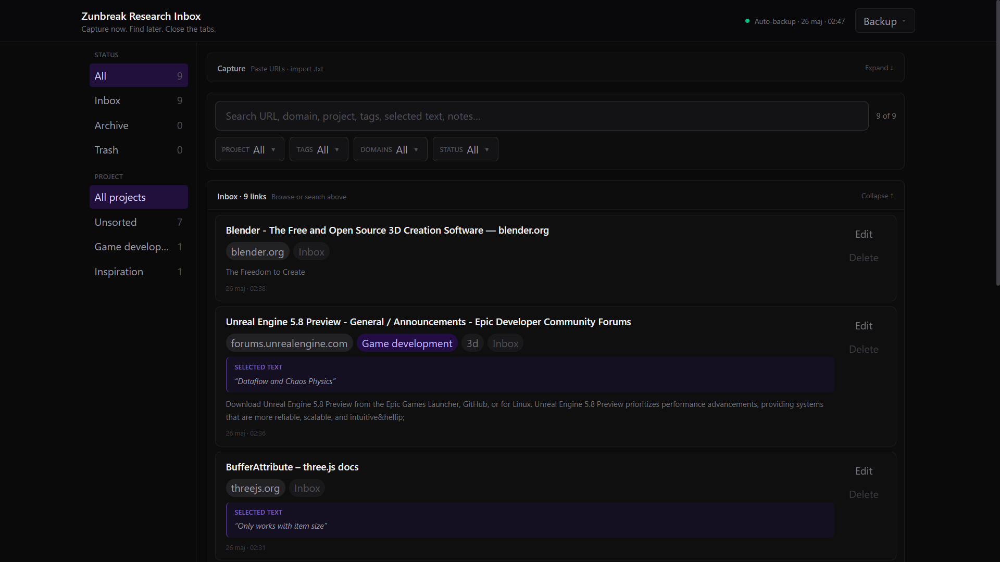
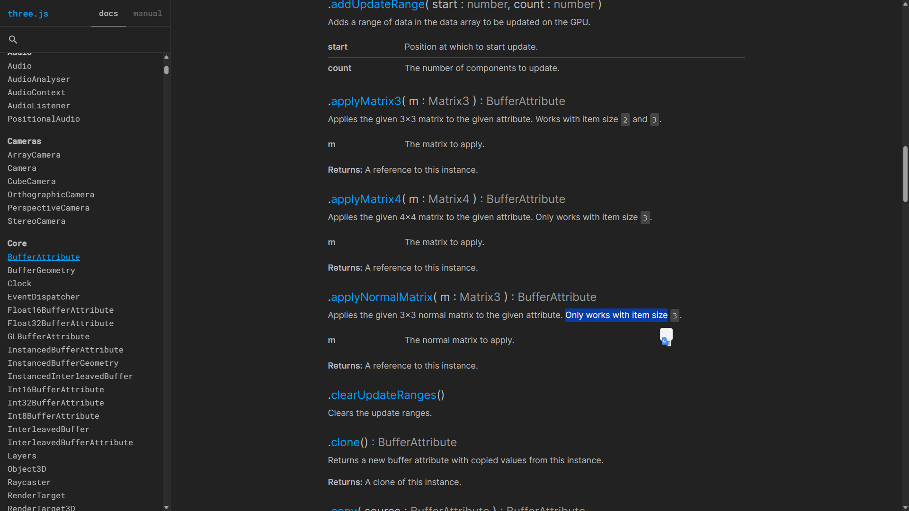
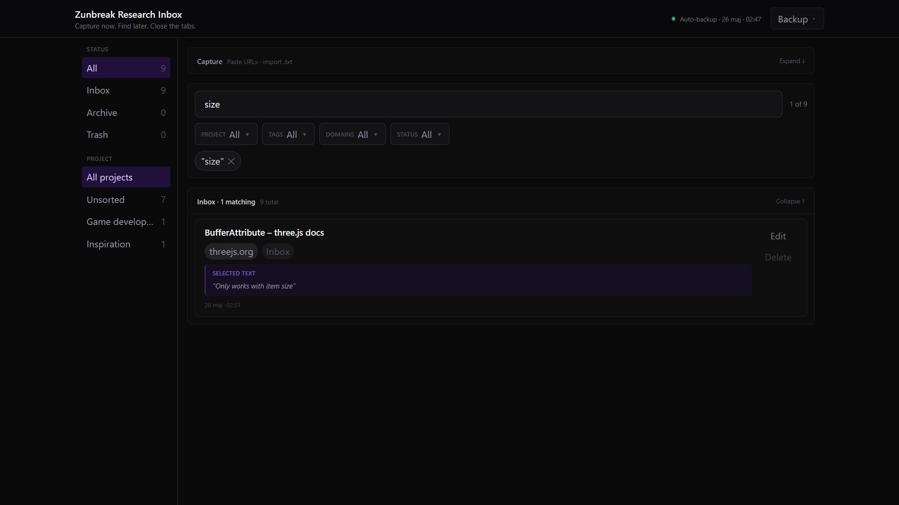
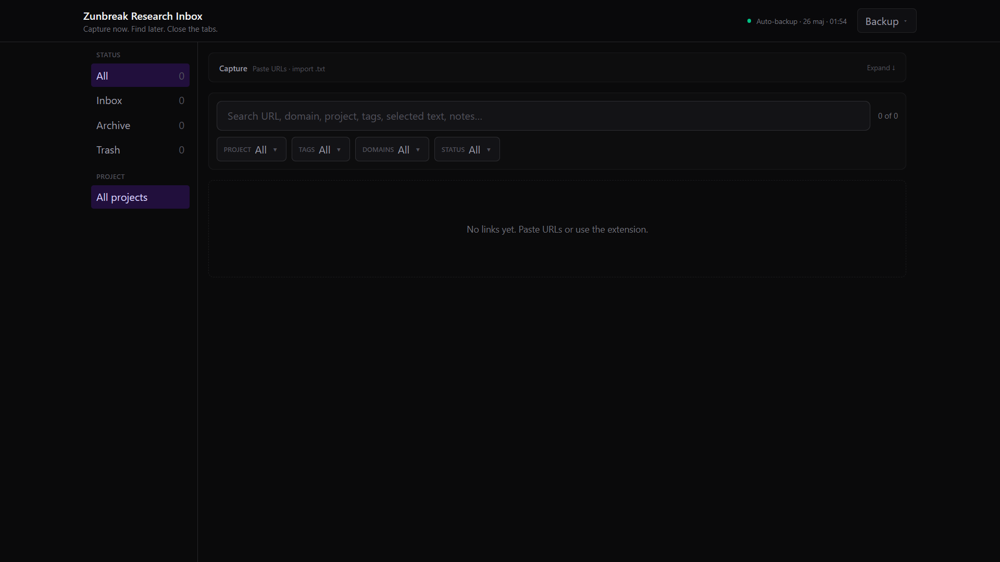
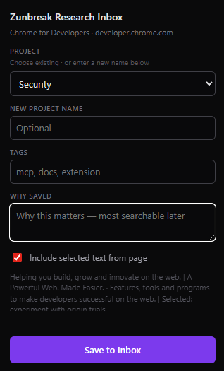

# Zunbreak Research Inbox


**Most bookmark tools save URLs.  
This saves the reason a page mattered.**

A local-first research inbox for capturing tabs, selected text, notes, tags, and searchable context.

No account. No cloud. No AI required.

By **Zunbreak**.

## Current status

This is a **local-first developer release**.

- Runs locally with `npm run dev`
- Browser extension is loaded manually from `extension/`
- Not packaged as a desktop app yet
- Not published to Chrome Web Store yet

## Who is this for?

- People drowning in open tabs who want a real research inbox
- Developers and builders doing technical research
- Anyone who wants **selected text + searchable notes**, not just bookmarked URLs
- Local-first, privacy-conscious users who do not want another SaaS account

## Screenshots



| Selected text on the card | Search by selected text |
|---------------------------|---------------------------|
|  |  |

| Empty inbox | Extension: Save to Inbox |
|-------------|--------------------------|
|  |  |

## Why I built this

I was tired of having 200 tabs open and pretending that was a research system.

Bookmarks were not enough. They saved the link, but not the reason I cared about it.

Zunbreak Research Inbox is my attempt to fix that: capture the page, save the important text, add a quick note, close the tab, and find it again when it actually matters.

## What it does

- **Paste** many URLs at once and close tabs guilt-free
- **Capture** the current tab via browser extension (title, meta, headings, selected text)
- **Search** across URL, domain, project, tags, notes, and captured page context
- **Filter** by status, project, tag, and domain
- **Treat URL fragments as distinct links:** `docs/page#SectionA` and `#SectionB` do not collide (useful for docs sites like Three.js)
- **Store** everything locally (`localStorage` + auto-backup to `data/links.json` while dev server runs)

## What the extension captures

One click saves more than a bookmark:

- **URL, page title, and domain**
- **Meta description** and Open Graph text (when the page has them)
- **Headings** (h1/h2) for extra search keywords
- **Selected text:** highlight the important sentence first, then save
- **Your note, project, and tags** (optional)

Everything above is searchable locally. You do not need to remember the URL. Search for a word from the page or the text you highlighted.

Paste in the app works without the extension (URL only). The extension adds rich page context from the active tab.

## Quick start

### App

```bash
npm install
npm run dev
```

Open **http://localhost:5173/**

Paste URLs (one per line) → **Save** → search and filter.

### Extension (optional)

1. Keep `npm run dev` running (API on port **5173**)
2. Brave/Chrome → **Extensions** → **Developer mode** → **Load unpacked**
3. Select the `extension/` folder
4. Pin the **Z** icon → browse → **Save to Inbox**

See [extension/README.md](extension/README.md) for details.

## Demo flow

1. Highlight important text on a page
2. Click the extension → add optional note → **Save to Inbox**
3. Open the app → search for words from the highlighted text
4. Found → without remembering the URL

## Privacy & security

- No external account or cloud backend
- Data stays on your machine
- Extension only reads the active tab **when you click Save**
- No AI, no API keys in the extension
- Local dev API validates request payloads and rejects oversized bodies
- `data/links.json` (your inbox) is **gitignored**. Never commit your saved links.

## Project structure

```
├── src/              # React app
├── extension/        # Brave/Chrome MV3 extension
├── data/             # Local inbox (links.json, not in git)
├── docs/screenshots/ # README images
└── vite-plugin-file-backup.ts
```

## Tech

Vite · React · TypeScript · Tailwind · Manifest V3 extension

## Future ideas

If there is interest, future versions may explore:

- Packaged desktop app and easier browser extension distribution
- Richer import/export formats
- Optional local AI-assisted tagging or summaries
- MCP/agent-friendly exports for local assistant workflows
- Deeper integration with personal knowledge systems

Nothing above is promised. The current tool works without AI: capture links, selected text, notes, tags, and search locally.

## License

MIT. See [LICENSE](LICENSE). Copyright (c) 2026 Zunbreak.

The code is open source under MIT. The Zunbreak name and logo are not licensed for reuse.
