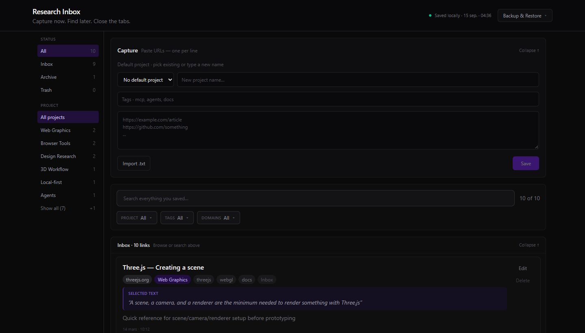
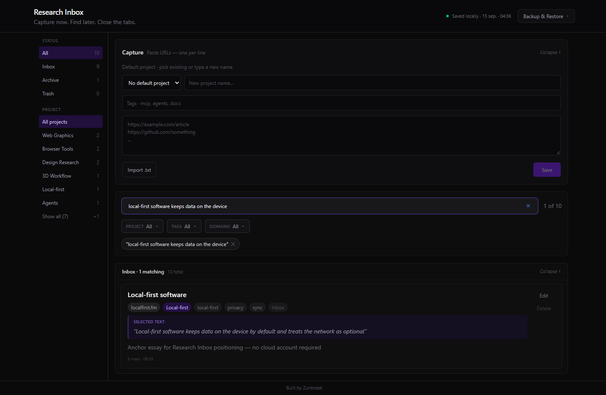
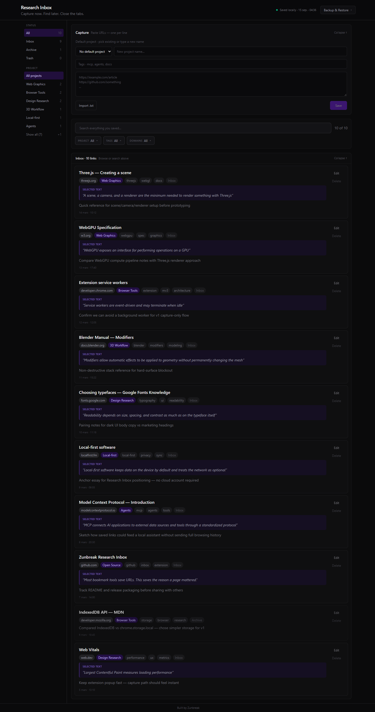

# Zunbreak Research Inbox


**Most bookmark tools save URLs.  
This saves the reason a page mattered.**

**Search by what you remember, not what you bookmarked.**

Highlight the part that mattered when you save a page. Later, search for the fragment you remember — even if you forgot the site or URL.



Local-first browser research.  
No account. No cloud. No AI required.

By **Zunbreak**.

| [Browser Extension](#install-browser-extension) | [Build from source](#build-standalone-extension-from-source) | [Developer Mode](#run-developer-mode) |
|---|---|---|
| Recommended · no Node required | Package the extension yourself | Hack on the app · localhost |

---

## See it in action

1. Highlight something useful on a page
2. Click **Z**
3. Add project, tags, or a note
4. **Save to Inbox**
5. Search for it later — by the words you highlighted, not the URL you forgot

### Search what you remember

You do not need to remember which site you saved. Remember a phrase from what you read — Research Inbox finds the page from the selected text you kept.



### Full inbox overview



<!-- Capture popup — add when 01-capture-popup.png exists (manual capture; synthetic demo data only)

-->

Demo data only in screenshots — see [docs/screenshots/README.md](docs/screenshots/README.md).

---

## Why Research Inbox?

Bookmarks save links. Research Inbox saves **context**:

- why you saved the page
- the sentence you highlighted — searchable later, even when the URL is not
- project and tags for later filtering
- searchable page metadata (title, description, headings)

I built this because 200 open tabs is not a research system.

---

## What it captures

**From the browser extension** (one click on the current tab):

- URL, title, and domain
- Meta description and Open Graph text (when present)
- Headings (h1/h2) for extra keywords
- **Selected text** — highlight first, then save
- Your note, project, and tags

**From the inbox** (paste panel):

- Many URLs at once (one per line)
- Optional default project and tags

Paste works without the extension (URL only). The extension adds rich page context from the active tab.

---

## Search & organisation

- Search by what you remember: selected text, notes, headings, tags, project, URL, and domain
- Find a saved page from a fragment you recall — you do not need to remember where you found it
- Filter by status (Inbox / Archive / Trash), project, tag, and domain
- URL fragments treated as distinct links (`page#SectionA` ≠ `page#SectionB`)

---

## Backup & Restore

Your inbox lives locally. Export a JSON backup anytime from **Backup & Restore** in the inbox.

- **Export backup** — download a portable copy; tracks last export time locally
- **Import backup** — **Merge** (add new links only, idempotent) or **Replace all** (destructive, requires confirmation)

No cloud sync. If you uninstall the extension or lose a browser profile, your backup file is the restore path.

---

## Privacy

- No account, no cloud backend, no analytics
- Data stays on your machine
- Extension reads the active tab **only when you click Save**
- No AI required; no API keys in the extension

**Where data is stored depends on how you run it** (see below). Private inbox files are gitignored — never commit your saved links.

---

## Use it your way

Three ways to run the same product — pick one:

| | Browser Extension | Build from source | Developer Mode |
|---|---|---|---|
| **For** | Normal use | Developers packaging the extension | Developing / hacking on the repo |
| **Node / npm** | Not required | Required | Required |
| **localhost** | No | No | Yes (`npm run dev`) |
| **Storage** | `chrome.storage.local` | `chrome.storage.local` | `localStorage` + `data/links.json` |

The standalone extension and developer app share the same inbox UI and link schema. Move data between them with **Export backup** / **Import backup**.

---

## Install Browser Extension

**Recommended.** Use Research Inbox without Node, npm, a terminal, or a dev server.

**Requirements:** Brave or Chrome (Chromium, Manifest V3)

Research Inbox is **not published in the Chrome Web Store yet**. Chrome Web Store distribution is planned; until then, install the standalone build manually from a packaged release.

**Packaged browser extension:** coming with the first GitHub Release.  
[View Releases](https://github.com/Zunbreak/research-inbox/releases)

<!-- After v1.0.0 release, replace the note above with:
**[Download Browser Extension](https://github.com/Zunbreak/research-inbox/releases/latest)** — extract the ZIP, then follow manual installation below.
-->

Until that release exists, developers can [build the extension from source](#build-standalone-extension-from-source).

### Manual installation (from release ZIP)

When a packaged release is available:

1. Download the latest extension ZIP from [GitHub Releases](https://github.com/Zunbreak/research-inbox/releases) and extract it
2. Open `chrome://extensions` or `brave://extensions`
3. Enable **Developer mode**
4. Click **Load unpacked**
5. Select the **extracted extension folder** (not the ZIP itself)
6. Pin **Zunbreak Research Inbox**
7. Done — browse → click **Z** → **Save to Inbox** → **Open Inbox**

No `npm run dev`. No localhost. Data stays in your browser profile.

---

## Build standalone extension from source

For developers who want to package the extension themselves (not required for normal use).

```bash
git clone https://github.com/Zunbreak/research-inbox.git
cd research-inbox
npm install
npm run build:extension
```

Then **Load unpacked** → select the `dist/extension/` folder (gitignored output).

Re-run `npm run build:extension` after pulling updates.

---

## Run Developer Mode

For development and hacking on the project — **not** the normal way to use Research Inbox.

```bash
git clone https://github.com/Zunbreak/research-inbox.git
cd research-inbox
npm install
npm run dev
```

Open **http://localhost:5173/**

Optional **DEV** extension (requires dev server on port 5173):

1. **Load unpacked** → `extension/` folder (named **Zunbreak Research Inbox (DEV)**)
2. See [extension/README.md](extension/README.md)

Copy `data/links.example.json` → `data/links.json` for a starter file, or import your own JSON backup.

---

## Project structure

```
├── src/                    # React inbox app (shared by web + extension build)
├── src/extension/          # Bundled popup + inbox entry (standalone build)
├── extension/              # DEV extension sources + prod HTML/manifest templates
├── scripts/                # Extension assemble + icon generation
├── data/                   # Local inbox in dev mode (gitignored)
├── docs/screenshots/       # README images (synthetic demo data)
└── vite-plugin-file-backup.ts
```

## Tech

Vite · React · TypeScript · Tailwind · Zod · Manifest V3

Storage adapters: `chrome.storage.local` (extension) · `localStorage` + file backup API (dev)

## Future ideas

If there is interest:

- Chrome Web Store listing (standalone build works; store submission not done yet)
- GitHub Release with pre-built extension ZIP for non-developer installs
- Richer import/export formats
- Optional local AI-assisted tagging or summaries
- MCP/agent-friendly exports
- Deeper integration with personal knowledge systems

Nothing above is promised. The current tool works without AI: capture links, selected text, notes, tags, and search locally.

## License

MIT. See [LICENSE](LICENSE). Copyright (c) 2026 Zunbreak.

The code is open source under MIT. The Zunbreak name and logo are not licensed for reuse.
